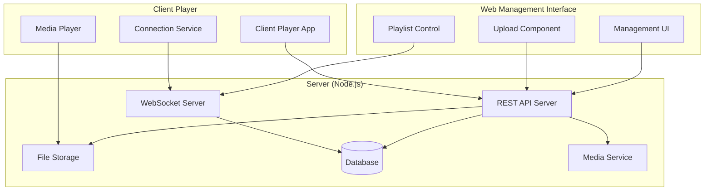

# Design Document

## Overview

The media playlist system consists of three main components:
1. **Server Application**: Node.js backend providing REST API, WebSocket communication, and media file management
2. **Web Management Interface**: Browser-based application for playlist creation and control
3. **Client Player Application**: Dedicated application for continuous media playback

The system uses a client-server architecture with real-time communication to enable centralized playlist management and distributed content display.

## Architecture



## Components and Interfaces

### Server Components

#### 1. Express REST API Server
- **Purpose**: Handle HTTP requests for playlist management and media operations
- **Endpoints**:
  - `GET /api/playlists` - List all playlists
  - `POST /api/playlists` - Create new playlist
  - `PUT /api/playlists/:id` - Update playlist
  - `DELETE /api/playlists/:id` - Delete playlist
  - `POST /api/media/upload` - Upload media files
  - `GET /api/media/:id` - Serve media files
  - `DELETE /api/media/:id` - Delete media files
  - `GET /api/playlists/:id/activate` - Set active playlist

#### 2. WebSocket Server
- **Purpose**: Real-time communication for playlist updates
- **Events**:
  - `playlist-activated` - Notify clients of active playlist change
  - `playlist-updated` - Notify of playlist content changes
  - `client-connected` - Handle new client connections
  - `heartbeat` - Maintain connection health

#### 3. Media Service
- **Purpose**: Handle media file processing and validation
- **Functions**:
  - File format validation
  - Metadata extraction (duration, dimensions)
  - Thumbnail generation for videos
  - File storage management

#### 4. Database Layer
- **Purpose**: Store playlist metadata and system state
- **Tables**:
  - `playlists` (id, name, description, created_at, updated_at)
  - `media_files` (id, filename, original_name, file_type, file_size, duration, created_at)
  - `playlist_items` (id, playlist_id, media_file_id, order_index)
  - `system_state` (active_playlist_id)

### Web Management Interface

#### 1. Playlist Management Component
- **Purpose**: CRUD operations for playlists
- **Features**:
  - List view with search and filtering
  - Drag-and-drop reordering
  - Bulk operations (delete, move)
  - Real-time status updates

#### 2. Media Upload Component
- **Purpose**: Handle file uploads with progress tracking
- **Features**:
  - Drag-and-drop file upload
  - Progress indicators
  - File validation and preview
  - Batch upload support

#### 3. Playlist Control Panel
- **Purpose**: Control active playlist and monitor client status
- **Features**:
  - Active playlist selection
  - Connected clients display
  - Playback status monitoring

### Client Player Application

#### 1. Media Player Engine
- **Purpose**: Handle media playback with format support
- **Features**:
  - HTML5 video/audio elements
  - Image display with timing
  - Smooth transitions between media
  - Fullscreen support

#### 2. Connection Manager
- **Purpose**: Maintain server connection and handle updates
- **Features**:
  - WebSocket connection management
  - Automatic reconnection logic
  - Offline playlist caching
  - Heartbeat monitoring

#### 3. Playlist Synchronizer
- **Purpose**: Keep local playlist state synchronized with server
- **Features**:
  - Playlist download and caching
  - Delta updates for efficiency
  - Conflict resolution

## Data Models

### Playlist Model
```typescript
interface Playlist {
  id: string;
  name: string;
  description?: string;
  items: PlaylistItem[];
  createdAt: Date;
  updatedAt: Date;
}
```

### Media File Model
```typescript
interface MediaFile {
  id: string;
  filename: string;
  originalName: string;
  fileType: 'video' | 'image';
  mimeType: string;
  fileSize: number;
  duration?: number; // for videos, display time for images
  thumbnailPath?: string;
  createdAt: Date;
}
```

### Playlist Item Model
```typescript
interface PlaylistItem {
  id: string;
  playlistId: string;
  mediaFileId: string;
  orderIndex: number;
  displayDuration?: number; // override for images
}
```

### Client State Model
```typescript
interface ClientState {
  id: string;
  currentPlaylist?: Playlist;
  currentItemIndex: number;
  playbackState: 'playing' | 'paused' | 'stopped';
  connectionStatus: 'connected' | 'disconnected' | 'reconnecting';
  lastHeartbeat: Date;
}
```

## Error Handling

### Server Error Handling
- **File Upload Errors**: Validate file types, size limits, and storage availability
- **Database Errors**: Handle connection failures, constraint violations, and transaction rollbacks
- **WebSocket Errors**: Manage connection drops, message delivery failures, and client timeouts
- **Media Processing Errors**: Handle corrupt files, unsupported formats, and processing timeouts

### Client Error Handling
- **Network Errors**: Implement exponential backoff for reconnection attempts
- **Media Playback Errors**: Skip problematic files and log errors for server reporting
- **Synchronization Errors**: Handle playlist conflicts and missing media files
- **Storage Errors**: Manage cache cleanup and storage quota limits

### Error Response Format
```typescript
interface ErrorResponse {
  error: {
    code: string;
    message: string;
    details?: any;
    timestamp: Date;
  };
}
```

## Testing Strategy

### Unit Testing
- **Server Components**: Test API endpoints, WebSocket handlers, and media processing functions
- **Client Components**: Test media player logic, connection management, and playlist synchronization
- **Database Layer**: Test CRUD operations, constraints, and transaction handling

### Integration Testing
- **API Integration**: Test complete request/response cycles with database operations
- **WebSocket Communication**: Test real-time message delivery and client synchronization
- **File Upload Flow**: Test end-to-end file upload, processing, and storage

### End-to-End Testing
- **Playlist Management**: Test complete playlist creation, modification, and activation workflows
- **Media Playback**: Test client playback across different media types and playlist transitions
- **Network Resilience**: Test client behavior during connection interruptions and recovery

### Performance Testing
- **Concurrent Clients**: Test server performance with multiple connected clients
- **Large Playlists**: Test playback performance with extensive playlists
- **File Upload**: Test upload performance with large media files
- **Memory Usage**: Monitor memory consumption during extended playback sessions

## Security Considerations

### File Upload Security
- File type validation using MIME type checking
- File size limits to prevent storage exhaustion
- Virus scanning for uploaded files
- Secure file storage with restricted access

### API Security
- Input validation and sanitization
- Rate limiting for API endpoints
- CORS configuration for web interface
- Authentication for administrative functions (future enhancement)

### Client Security
- Secure WebSocket connections (WSS in production)
- Media file access validation
- Protection against malicious playlist content